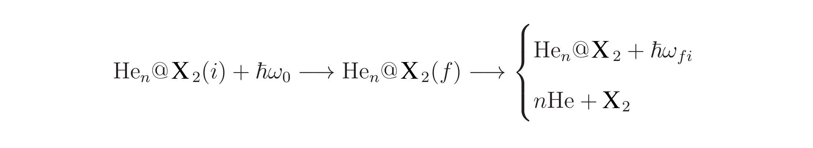

# henx2spec

hex 2spec (He<sub>n</sub>@X2-->spectrum) is a software package designed to calculate the vib-rotational Raman spectrum of a homonuclear diatomic molecule immersed in a helium cluster. The two-photons Raman process can be summarized as follows:



The first photon with energy  polarizes the system, inducing an electric dipole that allows the interaction with the electromagnetic radiation. Afterward, the system is excited to an intermediate state that eventually decays to a final state  through the emission of a photon with energy . Additionally, due to the system is weakly bonded, the absorbed energy can be enough to dissociate the aggregate following a process called "Vibrational Predissociation" which is directly related with the width of the bands in the final spectra.

To study this process the program uses the following system of coordinates:


The intensity of the absorption line  with energy  in resonance with the transition  is be written as
(
details in
[M. P. de Lara–Castells et al., *AIP Conf. Proc.* **1642**, 69-80 (2015)](https://aip.scitation.org/doi/abs/10.1063/1.4906632?journalCode=apc),
[M. P. de Lara–Castells et al., *J. Chem. Phys.* **132**, 194313 (2010)](https://aip.scitation.org/doi/abs/10.1063/1.3425997)],
[N. F. Aguirre et al., *Phys. Chem. Chem. Phys* **15**, 10126 (2013)](http://pubs.rsc.org/en/content/articlelanding/2013/cp/c3cp50282a)
):


# Execution of the program

```
$ HenX2Spec
Usage:
  $ HenX2_spec iFile T Jmax [JS] [JL] [LS] | [ALL]
```
First parameter is the input file, the second one is the temperature to be used to calculate the spectrum, and the third one is the maximum value of the angular momentum J to be considered. The other three parameters are optional and they allow to include the different kind of couplings. By default, the program will include ALL couplings.

Consider the following input file:
```
$ cat bosN4.inp
STATES 8
# id     S Lambda      L^2         E  Gamma
  1a   0.0      0    32.48    -64.49   2e-4  g+
  1b   0.0      0    28.06    -64.16   2e-4  g+
  2a   0.0      3    42.36    -63.66   2e-4  u 
  2b   0.0      1    40.00    -63.34   2e-4  u 
  3a   0.0      4    43.65    -62.76   2e-4  g 
  4a   0.0      0    33.33    -64.55   2e-4  u+
  5a   0.0      3    42.89    -63.73   2e-4  g 
  6a   0.0      2    37.21    -63.11   2e-4  u 

LCOUPLINGS 6
# id1  id2   <id1|L+/-|id2>
   1a   5b   -0.03006
   1b   5b    0.03877
   2a   6a   -0.02100
   2b   4a    0.02500
   2b   6a   -0.03500
   3a   5a    0.06390

SPECTRUM
  EMIN  -2.0
  EMAX   8.0
  ESTEP  0.001

DIATOMIC
  RE 1.9879
  WE 559.72
  WEXE 2.675
  RMASS 17.71285
  
  POLA 30.91 7.05 1.73 -2.17
  POLB 16.83 12.52 5.49 -4.50
  
```
This file contains:
1) List of the FCI-NO
2) List of the <L> couplings
3) Parameters to render the spectrum
4) Parameters of the Morse potential that represents the diatomic molecule X2
  
By executing the command
```
$  HenX2_spec bosN4.inp 0.5 3 ALL > bosN4.out
```
the program will calculate the pure states for v=0
```
 PURE STATES ( nu = 0 )
 ======================
 
 Upper primitive state = 6a
 
           Energy    Weight
           ------    ------
J =  0.0
    1   -57.42254   0.65472   0.20E-03         <1b(0,0.0)^1\Sigma+(0.0,0.0)g+| 
    2   -56.69126   0.07983   0.20E-03         <1a(0,0.0)^1\Sigma+(0.0,0.0)g+| 
    3   -56.54717   0.05274   0.20E-03         <4a(0,0.0)^1\Sigma+(0.0,0.0)u+| 
 
J =  1.0
    1   -56.94233   0.16441   0.20E-03         <1b(0,1.0)^1\Sigma+(0.0,0.0)g+| 
    2   -56.21105   0.02005   0.20E-03         <1a(0,1.0)^1\Sigma+(0.0,0.0)g+| 
    3   -56.06695   0.01324   0.20E-03         <4a(0,1.0)^1\Sigma+(0.0,0.0)u+| 
    4   -53.73564   0.00002   0.20E-03            <2b(0,1.0)^1\Pi-(-1.0,0.0)u| 
    5   -53.73564   0.00002   0.20E-03             <2b(0,1.0)^1\Pi+(1.0,0.0)u|
```

The notation used to represent the states is as follows:
```
<1b(0,0.0)^1\Sigma+(0.0,0.0)g+|
    ^   ^  ^         ^   ^
    |   |  |         |   |
    nu  |  |       Omega |
        |  |             |
        J  |           Sigma
           |
          2S+1
```
The following fragment of the output file shows the allowed transitions among vib-rotational pure states
```
 Transitions among pure states
 =============================
 
                     Initial State                End State             dE         I      Gamma Type
                     -------------                ---------             --         -      ----- ----
 
   <1a(0,0.0)^1\Sigma+(0.0,0.0)g+|
                            <1a(1,0.0)^1\Sigma+(0.0,0.0)g+|      -0.047243  0.024247   0.20E-03    Q
                            <1a(1,2.0)^1\Sigma+(0.0,0.0)g+|       1.384683  0.006855   0.20E-03    S
```
The following commands can be used to visualize both the energetic levels and the vib-rotational Raman spectrum:
```
$ HenX2Spec_plotSpectra -i bosN4.inp -p -y 5000 -r -0.07 -0.02
$ HenX2Spec_plotStates bosN4.inp
```


# Authors
* Nestor F. Aguirre ( nfaguirrec@gmail.com )
* Maria P. de Lara-Castells ( pilar.delara.castells@csic.es )
